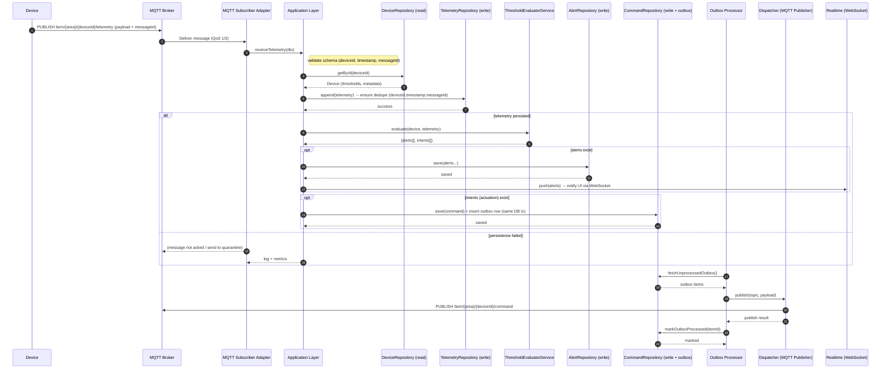

```mermaid
sequenceDiagram
  participant Device as Device
  participant MQTTBroker as MQTT Broker
  participant MQTTSub as MQTT Subscriber Adapter
  participant App as Application Layer
  participant DeviceRepo as DeviceRepository (read)
  participant TelemetryRepo as TelemetryRepository (write)
  participant ThresholdSvc as ThresholdEvaluatorService
  participant AlertRepo as AlertRepository (write)
  participant CommandRepo as CommandRepository (write + outbox)
  participant OutboxProc as Outbox Processor
  participant Dispatcher as Dispatcher (MQTT Publisher)
  participant Realtime as Realtime (WebSocket)
  autonumber

  Device ->> MQTTBroker: PUBLISH farm/{area}/{deviceId}/telemetry (payload + messageId)
  MQTTBroker ->> MQTTSub: Deliver message (QoS 1/2)
  MQTTSub ->> App: receiveTelemetry(dto)
  Note right of App: validate schema (deviceId, timestamp, messageId)
  App ->> DeviceRepo: getById(deviceId)
  DeviceRepo -->> App: Device (thresholds, metadata)
  App ->> TelemetryRepo: append(telemetry)  -- ensure dedupe (deviceId,timestamp,messageId)
  TelemetryRepo -->> App: success
  
  alt telemetry persisted
    App ->> ThresholdSvc: evaluate(device, telemetry)
    ThresholdSvc -->> App: {alerts[], intents[]}
    opt alerts exist
      App ->> AlertRepo: save(alerts...)
      AlertRepo -->> App: saved
      App ->> Realtime: push(alerts)  -- notify UI via WebSocket
    end
    opt intents (actuation) exist
      App ->> CommandRepo: save(command) + insert outbox row (same DB tx)
      CommandRepo -->> App: saved
    end
  else persistence failed
    MQTTSub -->> MQTTBroker: (message not acked / send to quarantine)
    App -->> MQTTSub: log + metrics
  end
  
  OutboxProc ->> CommandRepo: fetchUnprocessedOutbox()
  CommandRepo -->> OutboxProc: outbox items
  OutboxProc ->> Dispatcher: publish(topic, payload)
  Dispatcher ->> MQTTBroker: PUBLISH farm/{area}/{deviceId}/command
  Dispatcher -->> OutboxProc: publish result
  OutboxProc ->> CommandRepo: markOutboxProcessed(itemId)
  CommandRepo -->> OutboxProc: marked
```
