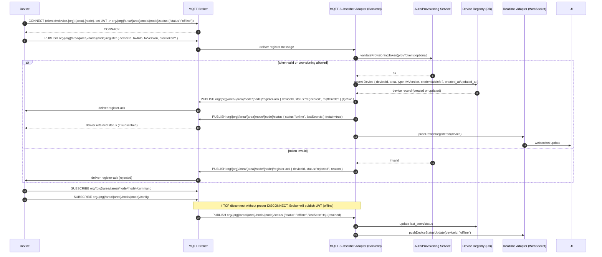

```mermaid
sequenceDiagram
  autonumber
  participant Device
  participant Broker as MQTT Broker
  participant Sub as MQTT Subscriber Adapter (Backend)
  participant Auth as Auth/Provisioning Service
  participant DB as Device Registry (DB)
  participant Realtime as Realtime Adapter (WebSocket)

  %% 1. Device connects and sets LWT

  Device->>Broker: CONNECT (clientId=device.{org}.{area}.{node}, set LWT -> org/{org}/area/{area}/node/{node}/status {"status":"offline"})

  Broker-->>Device: CONNACK

  %% 2. Device publishes registration request

  Device->>Broker: PUBLISH org/{org}/area/{area}/node/{node}/register { deviceId, hwInfo, fwVersion, provToken? }

  Broker->>Sub: deliver register message

  %% 3. Backend validates (optional prov token) and authorizes

  Sub->>Auth: validateProvisioningToken(provToken) [optional]

  alt token valid or provisioning allowed

	Auth-->>Sub: ok

	%% 4. Backend upsert device record in DB

	Sub->>DB: upsert Device { deviceId, area, type, fwVersion, credentialsInfo?, created_at/updated_at }

	DB-->>Sub: device record (created or updated)

	%% 5. Backend responds with registration ack and credentials (if provisioning)

	Sub->>Broker: PUBLISH org/{org}/area/{area}/node/{node}/register-ack { deviceId, status:"registered", mqttCreds? } (QoS=1)

	Broker->>Device: deliver register-ack

	%% 6. Backend publishes retained online status

	Sub->>Broker: PUBLISH org/{org}/area/{area}/node/{node}/status { status:"online", lastSeen:ts } (retain=true)

	Broker-->>Device: deliver retained status (if subscribed)

	%% 7. Backend notifies dashboard UI

	Sub->>Realtime: pushDeviceRegistered(device)

	Realtime->>UI: websocket update

  else token invalid

	Auth-->>Sub: invalid

	Sub->>Broker: PUBLISH org/{org}/area/{area}/node/{node}/register-ack { deviceId, status:"rejected", reason }

	Broker->>Device: deliver register-ack (rejected)

  end


  %% 8. Device subscribes to command/config topics after ack

  Device->>Broker: SUBSCRIBE org/{org}/area/{area}/node/{node}/command

  Device->>Broker: SUBSCRIBE org/{org}/area/{area}/node/{node}/config


  %% 9. Later: if device disconnects unexpectedly -> LWT triggers offline status

  Note over Broker,Sub: If TCP disconnect without proper DISCONNECT, Broker will publish LWT (offline)

  Broker->>Sub: PUBLISH org/{org}/area/{area}/node/{node}/status {"status":"offline","lastSeen":ts} (retained)

  Sub->>DB: update last_seen/status

  Sub->>Realtime: pushDeviceStatusUpdate(deviceId, "offline")
```