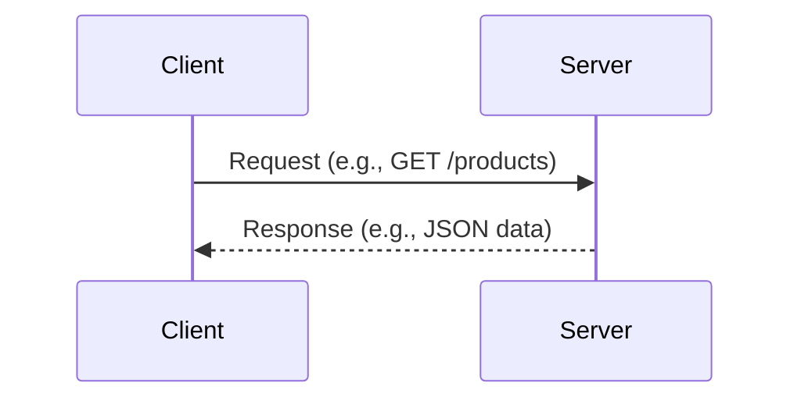

---
> [!INFORMATION] Overview
> The **client-server model** is a network architecture in which **clients** make requests for services or resources, and **servers** fulfill those requests, usually over a network.

---
## 📌 Key Characteristic
---

• **Separation of concerns**: Clients handle user interfaces and interactions; servers handle data, business logic, and services.
• **Scalability**: Servers can serve multiple clients at once.
• **Centralization**: Data and resources are often managed centrally on the server.
• **Communication**: Typically through standard protocols (like HTTP, FTP, TCP/IP).

---
## 📚 Details
---

#### How it work?
• A **client** initiates the connection.
• A **server** waits for and responds to that connection.
• One device or program **can be both** a client and a server (e.g., a server making API requests to another server = “client-server chaining”).

#### What can be classified as a client?
> A **client** is any device, application, or process that **requests** data or services from a server.

• **Web browsers** (Chrome, Firefox, Safari)
	→ Request web pages from web servers.
• **Mobile apps** (e.g., Instagram, WhatsApp)
	→ Request content, messages, or services from backend servers.
• **Desktop applications** (e.g., Outlook, Steam)
	→ Connect to mail servers or game servers.
• **Command-line tools** (e.g., curl, ftp, mysql client)
	→ Make direct requests to servers via CLI.
• **IoT devices** (e.g., smart thermostats, security cameras)
	→ Request updates or send data to cloud servers.
• **Games** (multiplayer clients)
	→ Connect to game servers for real-time data
#### What can be classified as a server?
> A **server** is any device, program, or process that **responds to client requests**, typically by providing services or data.

• **Web servers** (e.g., Apache, Nginx)
	→ Serve websites and web applications.
• **Database servers** (e.g., MySQL, PostgreSQL)
	→ Store and retrieve data on request.
• **Application servers** (e.g., Node.js, .NET Core, Java EE)
	→ Run backend logic for web/mobile apps.
• **Mail servers** (e.g., Microsoft Exchange, Postfix)
	→ Handle email sending and receiving.
• **Game servers** (e.g., Minecraft, CS:GO servers)
	→ Host multiplayer game logic and player data.
• **File servers** (e.g., Samba, FTP servers)
	→ Manage file sharing over networks.

---
## 🔗 REFERENCES
---

- [references]()